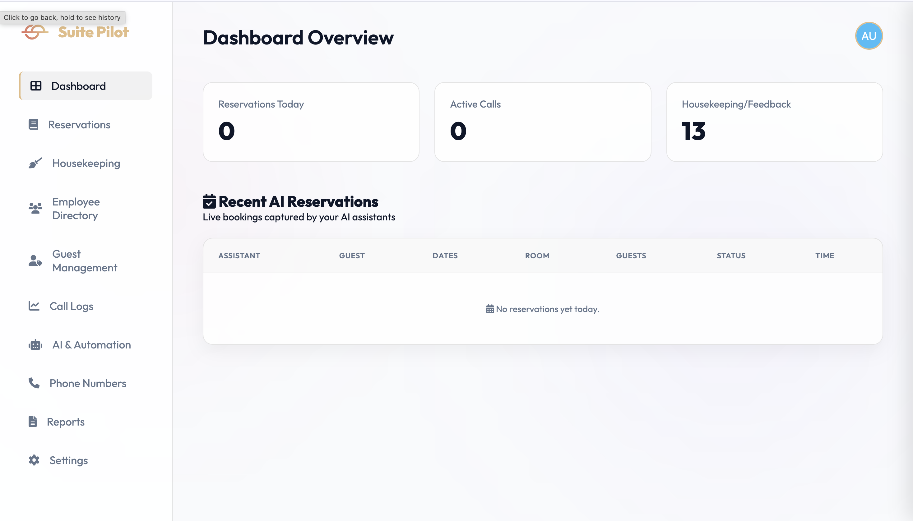

# 🏨 Suite Pilot: AI-Driven Hotel Voice Reservation System

Suite Pilot is a premium, automated hotel management dashboard that leverages cutting-edge AI agents to handle guest reservations over the phone. By combining **Vapi AI** for telephony and **Google Gemini 1.5 Flash** for intelligent data extraction, Suite Pilot provides a zero-touch booking experience with a stunning, modern glassmorphism interface.



## 🌟 Key Features

- **🤖 AI Voice Agents**: Fully autonomous AI assistants (Sophia, Ema, etc.) that handle inbound and outbound calls with natural human-like speech.
- **🧠 LLM-Powered Extraction**: Uses Gemini 2.5 Flash to analyze call transcripts and extract structured data (Guest name, room type, dates, and special requests).
- **📊 Real-Time Dashboard**: A high-end, glassmorphism UI for monitoring reservations, call stats, and agent performance.
- **📑 Detailed Insights**: Deep-dive into every reservation with full call transcripts, duration tracking, and extracted "Extras" (Spa, Breakfast, Late checkout).
- **📞 Management Center**: Centralized control for managing Vapi assistants and Twilio phone numbers.
- **🔗 Automated Webhooks**: Instant data synchronization via secure webhook endpoints.

## 🛠️ Technology Stack

- **Frontend**: Vanilla HTML5, JavaScript (ES6+), CSS3 (Modern Glassmorphism Design).
- **Backend**: Python Flask.
- **AI/ML**: 
    - **Telephony**: [Vapi AI](https://vapi.ai)
    - **Extraction**: [Google Gemini 1.5 Flash](https://aistudio.google.com/)
- **Infrastructure**: Ngrok (for webhook tunneling), Twilio (via Vapi).

## 🚀 Getting Started

### Prerequisites
- Python 3.8+
- [Vapi API Key](https://dashboard.vapi.ai/)
- [Google Gemini API Key](https://aistudio.google.com/)

### Installation

1. **Clone the repository**:
   ```bash
   git clone https://github.com/yourusername/suite-pilot.git
   cd suite-pilot
   ```

2. **Setup Backend**:
   ```bash
   cd backend
   pip install -r requirements.txt
   ```

3. **Configure Environment Variables**:
   Create a `.env` file in the `backend/` directory:
   ```env
   VAPI_API_KEY="your_vapi_key"
   GEMINI_API_KEY="your_gemini_key"
   GEMINI_URL="https://generativelanguage.googleapis.com/v1beta/models/gemini-flash-latest:generateContent"
   TWILIO_PHONE_NUMBER="your_twilio_number"
   TWILIO_ACCOUNT_SID="your_sid"
   TWILIO_AUTH_TOKEN="your_token"
   ```

4. **Run the Application**:
   ```bash
   python3 app.py
   ```

5. **Expose Webhook (Optional but recommended for testing)**:
   ```bash
   ngrok http 5001
   ```
   *Note: Update the Vapi Assistant webhook URL with your ngrok address.*

## 📂 Project Structure

- `backend/`: Flask application, Gemini integration, and API routes.
- `frontend/`: HTML, CSS (Glassmorphism theme), and JavaScript logic.
- `frontend/js/`: Modular JS for main dashboard, assistants, and phone management.
- `frontend/css/`: Premium design system and layout.

## 🏗️ Architecture

For a deep dive into how Suite Pilot processes calls and extracts data, see the [Architecture Document](architecture.md).

## 📄 License

This project is licensed under the MIT License - see the [LICENSE](LICENSE) file for details.
