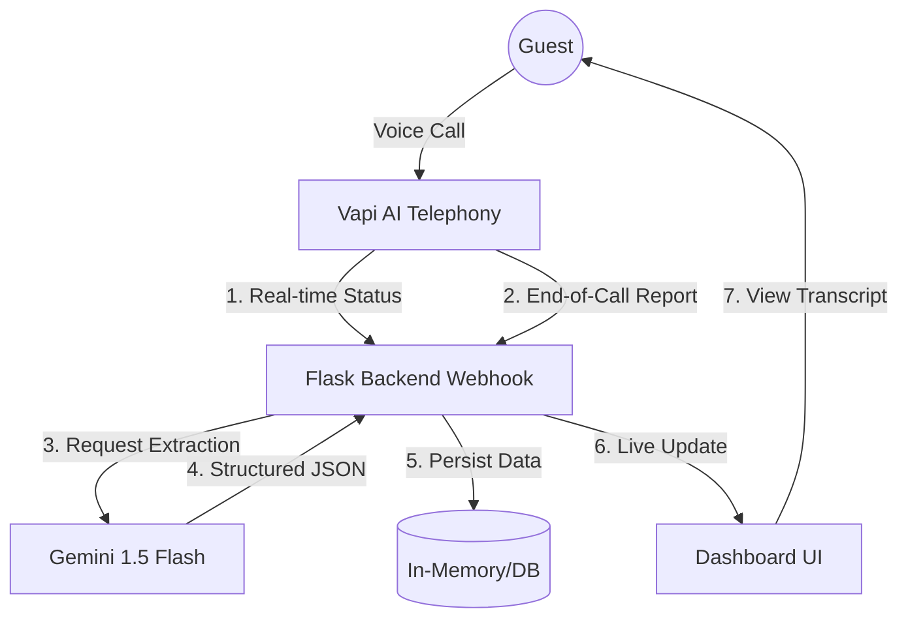

# 🏗️ Suite Pilot Architecture

This document outlines the technical architecture and data flow of the Suite Pilot Hotel Voice Reservation System.

## 🔄 High-Level Data Flow

The system operates as a closed-loop feedback system between the guest, the AI telephony engine, and the management dashboard.

## 🧩 Components

### 1. Telephony Layer (Vapi AI)
- **Role**: Handles real-time voice synthesis (TTS), recognition (STT), and conversational logic.
- **Integration**: Communicates via Webhooks (`/api/webhook/vapi`).
- **Data Provided**: Call status (queued, in-progress, ended), Full Transcripts, AI-generated summaries.

### 2. Intelligence Layer (Google Gemini 1.5 Flash)
- **Role**: Acts as the "Data Brain." 
- **Workflow**: 
    - Receives raw transcript from the backend.
    - Uses a specialized prompt to extract specific fields: `guestName`, `checkInDate`, `checkOutDate`, `roomType`, `guestsCount`, and `extras`.
    - Returns a clean JSON object for seamless integration.

### 3. Backend Logic (Flask)
- **Role**: Orchestrator and API Gateway.
- **Endpoints**:
    - `POST /api/webhook/vapi`: Processes call reports and triggers Gemini extraction.
    - `GET /api/reservations`: Serves captured reservations to the frontend.
    - `PATCH /api/assistants/<id>`: Management endpoint for updating agent configurations.
- **Duration Safety**: Calculates call duration by comparing `startedAt` and `endedAt` timestamps if direct data is missing.

### 4. Presentation Layer (Vanilla JS & CSS)
- **Role**: Premium User Interface.
- **Design System**: Built on a Glassmorphism aesthetic using high-blur backdrops, vibrant gradients, and modern typography (Outfit).
- **Side Drawer**: A modular detailed view component that displays extracted data and full transcripts using an asynchronous ID-based lookup.

## 🧪 Data Extraction Logic

The system prioritizes intelligence over simple parsing. When a call ends:
1. The backend receives a `transcript`.
2. It sends the transcript to Gemini with a **System Prompt** that enforces a specific JSON structure.
3. Gemini interprets natural language (e.g., "three nights starting next Friday") into hard dates.
4. The backend merges this with Vapi's metadata (call duration, customer phone number) to create a complete `Reservation Object`.

## 🔒 Security & Scaling
- **Environment**: Sensitive API keys are stored in `.env`.
- **Tunneling**: Ngrok is used during development to expose the local Flask server to Vapi's public webhook calls.
- **Future Growth**: The architecture is designed to transition from in-memory storage to a persistent database (PostgreSQL/MongoDB) with minimal changes to the API layer.
